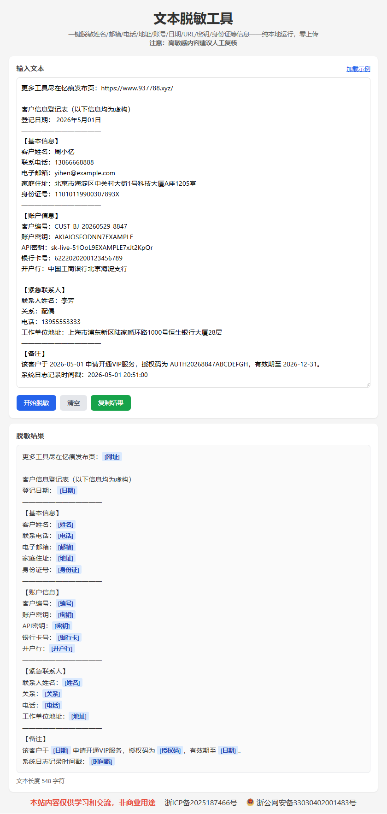

# 文本脱敏工具

一个纯前端的文本隐私信息脱敏工具，无需服务器，数据零上传。可检测姓名/邮箱/电话/地址/账号/日期/URL/密钥/身份证号/职位/关系/开户行/公司名称等信息，一键生成脱敏文本。

演示地址：https://textmask.937788.xyz/

## 功能

- **智能识别**：自动检测姓名、邮箱、电话、地址、身份证号、银行卡号、URL、密钥、日期、时间戳、IP、职位、关系、开户行、公司名称等敏感信息
- **一键脱敏**：点击按钮即时替换为 `[标签]` 格式
- **纯本地运行**：所有处理在浏览器内完成，数据不会离开您的设备
- **快捷键支持**：`Ctrl + Enter` 快速执行脱敏

## 使用方式

1. 打开 `index.html`（直接双击或用浏览器打开即可，无需部署）
2. 将需要脱敏的文本粘贴到输入框
3. 点击「开始脱敏」或按 `Ctrl + Enter`
4. 复制脱敏后的结果

## 脱敏规则

- **姓名** → `[姓名]`（如：周小忆）
- **电话** → `[电话]`（如：13866668888）
- **邮箱** → `[邮箱]`（如：yihen@example.com）
- **身份证号** → `[身份证]`（如：11010119900307893X）
- **银行卡** → `[银行卡]`（如：6222020200123456789）
- **地址** → `[地址]`（如：北京市海淀区中关村大街1号）
- **公司** → `[公司]`（如：北京科技有限公司）
- **职位** → `[职位]`（如：技术总监）
- **关系** → `[关系]`（如：配偶）
- **开户行** → `[开户行]`（如：中国工商银行北京海淀支行）
- **URL** → `[网址]`（如：https://example.com）
- **密钥** → `[密钥]`（如：sk-live-xxx）
- **编号** → `[编号]`（如：CUST-BJ-20260529-8847）
- **授权码** → `[授权码]`（如：AUTH2026ABCDEFGH）
- **日期** → `[日期]`（如：2026年5月01日）
- **时间戳** → `[时间戳]`（如：1767259932000）
- **IP** → `[IP]`（如：192.168.1.1）

## 使用场景

- **客服对话脱敏**：清理聊天记录中的客户姓名、电话、地址等隐私信息，用于案例分享或培训材料
- **日志文件处理**：对系统日志中的身份证号、银行卡号、密钥等进行批量脱敏，便于安全审计和日志归档
- **测试数据生成**：将真实业务数据快速转换为可用于开发/测试环境的脱敏样本，避免泄露生产数据
- **文档公开分享**：在发布技术文档、Bug 报告或数据分析结果前，自动移除其中的敏感个人信息
- **合规报告编写**：满足 GDPR、《个人信息保护法》等法规要求，在报告中对涉及的个人信息进行标准化脱敏处理
- **数据迁移交接**：团队间传递数据样本时，先脱敏再发送，降低信息泄露风险

## 技术说明

- 采用正则表达式 + 关键词匹配双引擎识别
- 百家姓库辅助检测中文姓名
- 冒号格式优先匹配（如 `姓名：xxx`）
- 无依赖，单 HTML 文件即可运行

## 注意事项

**高敏感内容建议人工复核。** 自动识别基于模式匹配，可能存在漏检或误判，重要场景请二次检查。

## 截图

